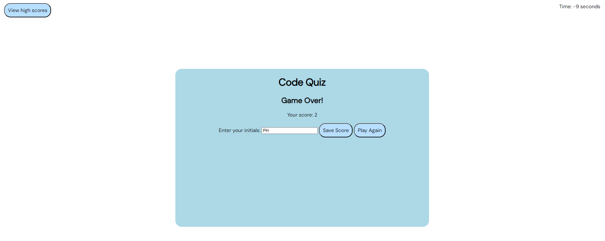

## Code Quiz
The Code Quiz is a web-based quiz application where users can test their knowledge of JavaScript and coding concepts. Users can answer multiple-choice questions within a time limit, and their scores are saved in a high scores list. The application also provides options to view high scores, save initials and scores, and play the quiz again.

## Features
Multiple-choice questions on JavaScript and coding concepts.
Timer to track the remaining time for each question.
Score calculation based on correct answers.
High scores list with user initials and scores.
Options to view high scores, save scores, and play the quiz again.

## Screenshots
Code Quiz Screenshot 1
Screenshot 1: Starting the quiz

Code Quiz Screenshot 2
Screenshot 2: Answering questions

Code Quiz Screenshot 3
Screenshot 3: Game over, entering initials

Code Quiz Screenshot 4
Screenshot 4: Viewing high scores

## Usage
Click the "Start Quiz" button to begin the quiz.

Answer the multiple-choice questions presented to you. For each correct answer, your score increases. For each incorrect answer, time is deducted from the timer.

Once all questions are answered or the timer reaches 0, the game is over.

Enter your initials in the provided input field and click the "Save Score" button to save your score.

You can view high scores by clicking the "View High Scores" button. You can also go back to the game or play the quiz again from the high scores screen.

## JavaScript Description
The JavaScript code in this application performs the following key functions:

Quiz Initialization: The quiz is initialized when the user clicks the "Start Quiz" button. The questions are loaded, and the timer starts.

Loading Questions: Questions are loaded one at a time, and the user selects their answer by clicking on one of the multiple-choice options.

Answer Validation: The code checks whether the selected answer is correct or not. If correct, the user's score is incremented; if incorrect, time is deducted from the timer.

Timer: The timer counts down from the initial time limit. If it reaches 0, the game ends.

End Game: When all questions are answered or the timer reaches 0, the game is over. The user can save their score with initials.

High Scores: The code manages high scores by saving them in session storage. Users can view high scores, and the top scores are displayed.

Restart Game: Users have the option to play the quiz again from the game over screen.

## Customization
You can customize the Code Quiz to add more questions or change the quiz's appearance. Here's how:

## Adding Questions: 
Open the script.js file and add more questions to the questions array following the existing format.

## Styling: 
You can modify the CSS styles in the styles.css file to change the appearance of the quiz, buttons, and high scores screen.

## License
This project is licensed under the MIT License - see the LICENSE file for details.